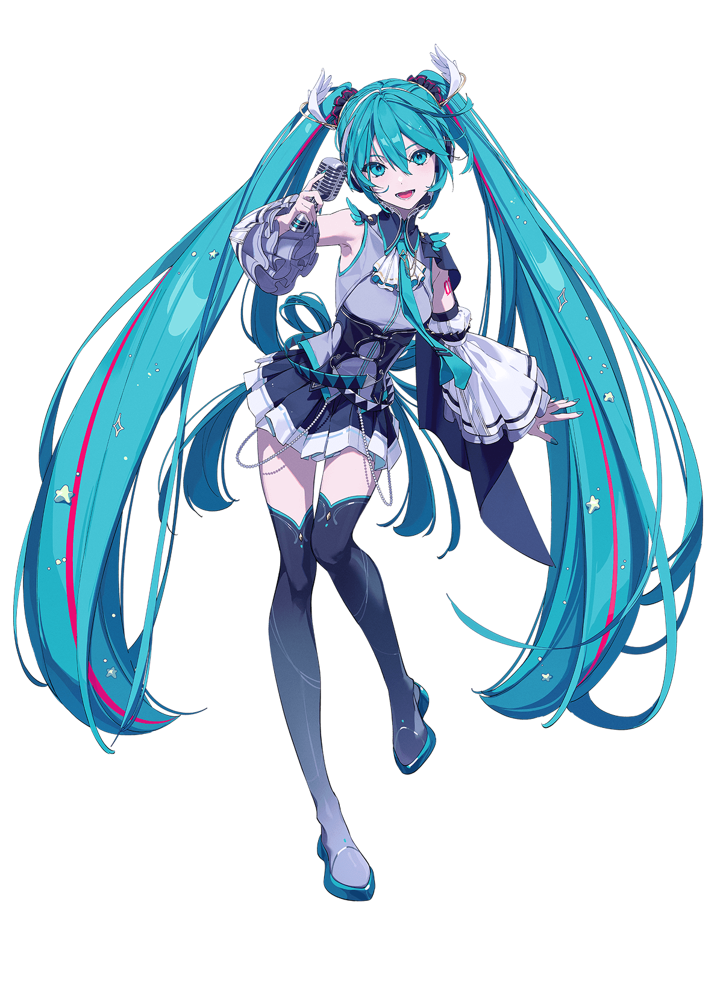

# 👋 Hey everyone, I'm Patepic


# About Me 

### 🎯 Full-Stack Web Developer | MERN Stack | Pixel-Perfect Design



```
😄 They/Them | 💻 Web dev and coder at heart
✨ Skilled in JS, React, and Node building clean, responsive apps
🌱 Experienced with Java, Python, C++, TypeScript, and SQL
🦀 Learning Rust to level up my systems skills
🎮 Gamer, tech enthusiast, and community-driven creator
💡 Enjoy tackling challenging problems and experimenting with new tech
💻 Contributor to open-source projects and personal coding experiments
🎨 Passionate about UI/UX design and crafting polished user experiences
🌍 Love connecting with devs worldwide and sharing knowledge
📚 Always learning new frameworks, languages, and tools
🏳️‍🌈 Proud LGBTQ+ dev always happy to connect
```
<br clear="both">

# 🛠️ My Go To Tools and Technologies
         

# 💻 Tech Stack
<div>


<h3>Languages & Frameworks</h3>


<h3>Databases & Cloud</h3>


<h3>Tools & Editors</h3>


<h3>Misc</h3>


</div>

<br>

# Profile Views


</div>

# 🤓 My Stats
<p>
  
</p>

<p>
  
  
</p>

# My Contributions
<picture>
  <source media="(prefers-color-scheme: dark)" srcset="https://raw.githubusercontent.com/patepic/patepic/output/github-snake-dark.svg" />
  <source media="(prefers-color-scheme: light)" srcset="https://raw.githubusercontent.com/patepic/patepic/output/github-snake.svg" />
  
</picture>

# 🌐 Socials

[](https://www.youtube.com/channel/UCahKkSPFYLTz_NK-Hp9q1dw) 
[](https://www.twitch.tv/patepic) 
[](https://www.tiktok.com/@patepic) 
[](https://www.instagram.com/patepic) 
[](https://twitter.com/patepicvt)  
